# Vehicle-Invariant Ego-Speed Estimation from In-Vehicle Dashcam Videos

[](https://www.python.org/)
[](https://pytorch.org/)
[](LICENSE)

**Jeonghyeon Kim, Youngwon Kim, and Jun Seong Lee**

Official PyTorch implementation and qualitative results for our IEEE Access
paper.

The method estimates ego-vehicle speed from 13-frame dashcam clips and is
designed to generalize to vehicles that are not observed during training. It
combines a FlexiNet backbone, SmartROI feature masking, and vehicle-adversarial
disentanglement.

The repository includes the final model and training code plus five pretrained
LOVO checkpoints for immediate evaluation. The model-ready dataset is
distributed separately.

## Results

Results use five-fold leave-one-vehicle-out evaluation, three random seeds, and
the ground-truth range `0.5 <= speed < 20 m/s`.

| Method | MAE (m/s) | RMSE (m/s) |
|---|---:|---:|
| 3DCMA | 2.617 +/- 0.132 | 3.250 +/- 0.153 |
| FlexiNet | 1.781 +/- 0.038 | 2.365 +/- 0.018 |
| **EgoSpeed-SmartROI** | **1.300 +/- 0.024** | **1.819 +/- 0.041** |

The proposed model reduces MAE by 27.0% and RMSE by 23.1% relative to FlexiNet.

## Qualitative Videos

The following autoplay previews compare the ground-truth speed, FlexiNet
prediction, and our prediction on unseen holdout vehicles. Click any preview to
play the complete 15-second MP4. Error colors are green (`<= 1 m/s`), yellow
(`1--2 m/s`), and red (`> 2 m/s`).

These clips were selected to illustrate qualitative behavior and should not be
interpreted as aggregate test results. The complete quantitative results are
reported above and in the paper.

### Hyundai Avante

<table>
  <tr>
    <td align="center"><a href="assets/videos/avante_01.mp4">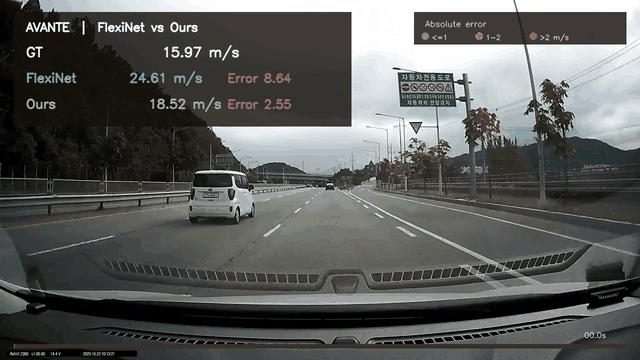</a><br><b>Example 1</b><br><sub>FlexiNet MAE: 8.215 | Ours: 0.800 m/s</sub></td>
    <td align="center"><a href="assets/videos/avante_02.mp4">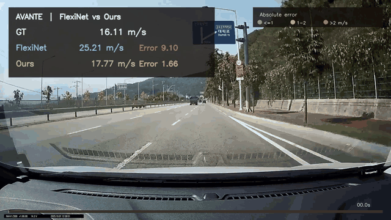</a><br><b>Example 2</b><br><sub>FlexiNet MAE: 9.072 | Ours: 1.671 m/s</sub></td>
    <td align="center"><a href="assets/videos/avante_03.mp4">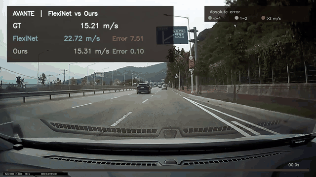</a><br><b>Example 3</b><br><sub>FlexiNet MAE: 7.658 | Ours: 1.257 m/s</sub></td>
  </tr>
</table>

### Chevrolet Malibu

<table>
  <tr>
    <td align="center"><a href="assets/videos/malibu_01.mp4">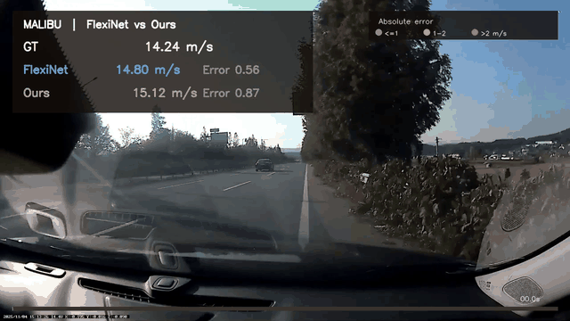</a><br><b>Example 1</b><br><sub>FlexiNet MAE: 4.485 | Ours: 1.225 m/s</sub></td>
    <td align="center"><a href="assets/videos/malibu_02.mp4">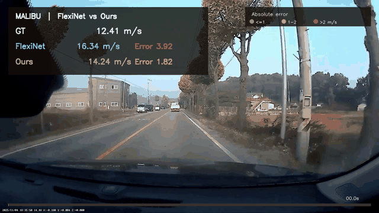</a><br><b>Example 2</b><br><sub>FlexiNet MAE: 3.083 | Ours: 0.739 m/s</sub></td>
    <td align="center"><a href="assets/videos/malibu_03.mp4">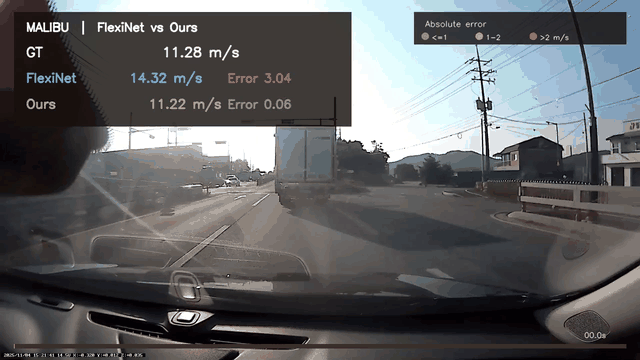</a><br><b>Example 3</b><br><sub>FlexiNet MAE: 2.713 | Ours: 1.017 m/s</sub></td>
  </tr>
</table>

### Hyundai Sonata

<table>
  <tr>
    <td align="center"><a href="assets/videos/sonata_01.mp4">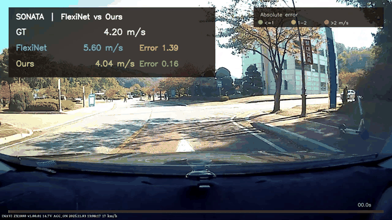</a><br><b>Example 1</b><br><sub>FlexiNet MAE: 5.203 | Ours: 0.869 m/s</sub></td>
    <td align="center"><a href="assets/videos/sonata_02.mp4">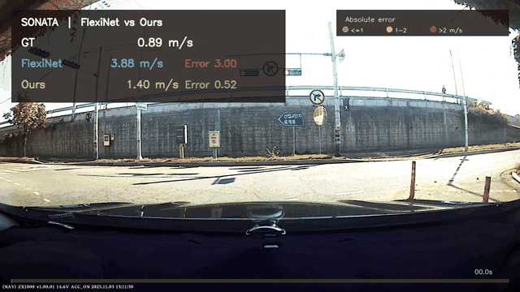</a><br><b>Example 2</b><br><sub>FlexiNet MAE: 3.993 | Ours: 1.061 m/s</sub></td>
    <td align="center"><a href="assets/videos/sonata_03.mp4">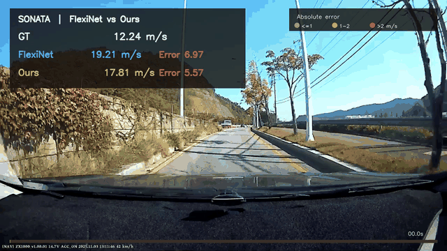</a><br><b>Example 3</b><br><sub>FlexiNet MAE: 3.259 | Ours: 1.155 m/s</sub></td>
  </tr>
</table>

### Kia Carnival

<table>
  <tr>
    <td align="center"><a href="assets/videos/carnival_01.mp4">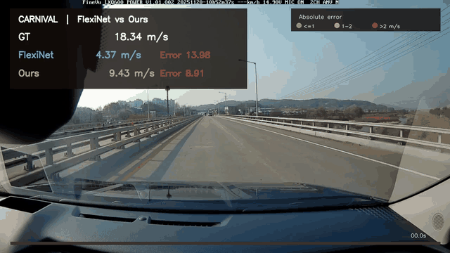</a><br><b>Example 1</b><br><sub>FlexiNet MAE: 6.463 | Ours: 1.884 m/s</sub></td>
    <td align="center"><a href="assets/videos/carnival_02.mp4">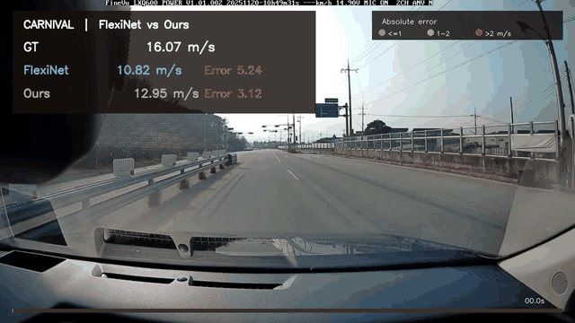</a><br><b>Example 2</b><br><sub>FlexiNet MAE: 6.636 | Ours: 2.001 m/s</sub></td>
    <td align="center"><a href="assets/videos/carnival_03.mp4">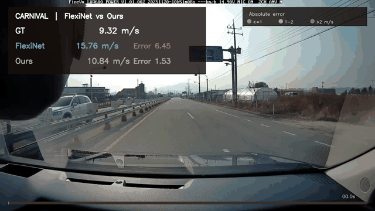</a><br><b>Example 3</b><br><sub>FlexiNet MAE: 5.001 | Ours: 1.237 m/s</sub></td>
  </tr>
</table>

### Renault XM3

<table>
  <tr>
    <td align="center"><a href="assets/videos/xm3_01.mp4">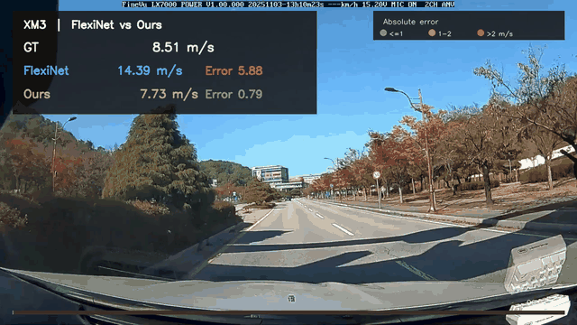</a><br><b>Example 1</b><br><sub>FlexiNet MAE: 2.686 | Ours: 1.420 m/s</sub></td>
    <td align="center"><a href="assets/videos/xm3_02.mp4">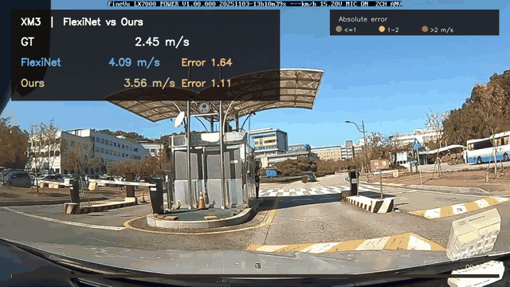</a><br><b>Example 2</b><br><sub>FlexiNet MAE: 1.974 | Ours: 1.334 m/s</sub></td>
    <td align="center"><a href="assets/videos/xm3_03.mp4">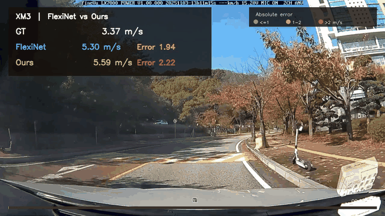</a><br><b>Example 3</b><br><sub>FlexiNet MAE: 1.604 | Ours: 0.904 m/s</sub></td>
  </tr>
</table>

## Final Model

- Clip: `13 x 3 x 48 x 86`
- Channels: grayscale + raw optical-flow rates `(u, v)`
- SmartROI: MiDaS relative depth + RAFT optical flow, generated offline
- Backbone: CMA -> AFT -> SFE/MFE -> DIG
- Speed branch: SmartROI-masked feature, Res3D block, global average pooling
- Vehicle branch: unmasked feature, Res3D block, global average pooling
- Training-only heads: private vehicle classifier and GRL vehicle classifier
- Regression loss: SmoothL1
- Orthogonality and HSIC losses: not used

Depth-normalized flow is **not** an input to the final model. Relative depth is
used only when constructing the precomputed SmartROI masks.

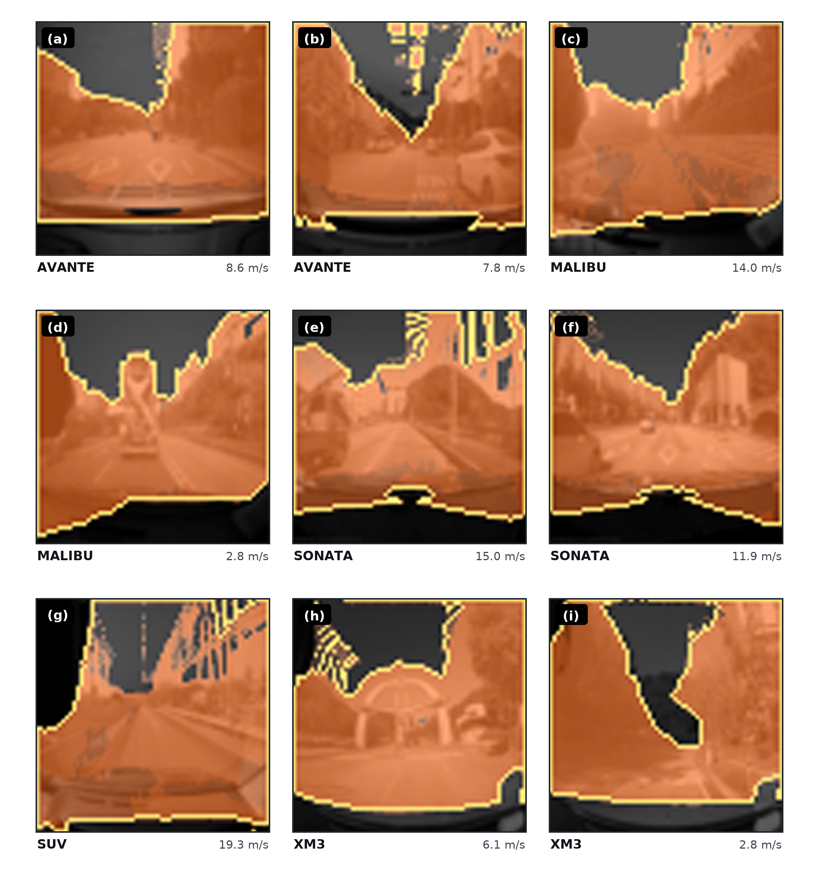

## Installation

Python 3.10 or later and a CUDA-capable PyTorch installation are recommended.

Linux/macOS:

```bash
cd EgoSpeed-SmartROI
python -m venv .venv
source .venv/bin/activate
pip install --upgrade pip
pip install -e .
```

Windows PowerShell:

```powershell
cd EgoSpeed-SmartROI
py -3.10 -m venv .venv
.\.venv\Scripts\Activate.ps1
python -m pip install --upgrade pip
pip install -e .
```

For a CUDA build, install the appropriate PyTorch wheel for the local CUDA
version before running `pip install -e .`.

## Repository Layout

```text
EgoSpeed-SmartROI/
  checkpoints/             Five seed-42 LOVO pretrained models
  assets/videos/           Fifteen FlexiNet-vs-Ours comparison videos
  assets/previews/         Autoplay GIF previews used in this README
  configs/final.json       Final paper hyperparameters
  scripts/train_lovo.py    Training entry point
  scripts/evaluate.py      Evaluation entry point
  splits/                  Five vehicle holdout definitions
  src/egospeed/            Model, data loader, losses, and metrics
  tests/                    Release smoke tests
```

## Dataset

- Model-ready dataset: **TODO: add Google Drive URL**
- Original synchronized videos and OBD speeds: **TODO: add Google Drive URL**
- Pretrained checkpoints: included under `checkpoints/`

The model-ready archive should be extracted as follows:

```text
EgoSpeedDataset/
  packed/
    <sequence_name>/
      packed_depthnorm64.pt
  smartroi_masks/
    <sequence_name>__smartroi_mask_u8.pt
```

The historical pack filename contains `64`, but the tensors used by the final
model have shape `48 x 86`. The public split definition is included at
[`splits/holdout_splits.json`](splits/holdout_splits.json). See
[`docs/DATASET.md`](docs/DATASET.md) for the tensor schema and measured sizes.

Validate a downloaded dataset before training:

```bash
python scripts/inspect_dataset.py \
  --dataset-root /path/to/EgoSpeedDataset
```

## Quick Evaluation

The released code evaluates model-ready packed data. Download and extract the
dataset first, then replace `/path/to/EgoSpeedDataset` in the commands below.
Direct inference from an arbitrary raw MP4 is not included in this release.

Evaluate one included pretrained fold:

```bash
python scripts/evaluate.py \
  --checkpoint checkpoints/holdout_avante/best.pt \
  --dataset-root /path/to/EgoSpeedDataset
```

Five seed-42 checkpoints are included for Avante, Malibu, Sonata, Carnival, and
XM3. Each checkpoint is evaluated on the vehicle named by its directory.
Predictions and metrics are written under `outputs/evaluation/`.

Evaluate all five included holdouts:

```bash
for vehicle in avante malibu sonata suv xm3; do
  python scripts/evaluate.py \
    --checkpoint "checkpoints/holdout_${vehicle}/best.pt" \
    --dataset-root /path/to/EgoSpeedDataset
done
```

## Training

Train all five holdout folds for one seed:

```bash
python scripts/train_lovo.py \
  --config configs/final.json \
  --dataset-root /path/to/EgoSpeedDataset \
  --seed 42 \
  --holdout all
```

Repeat with seeds `45` and `46` for the paper protocol. To verify the data and
model connection without training, add `--dry-run --holdout holdout_avante`.

The best checkpoint is selected using validation MAE. The test set is evaluated
only after training, and test predictions are not used for checkpoint selection.

## Pretrained Checkpoints

Five actual validation-best checkpoints from seed 42 of the final experiment
are included under `checkpoints/` (approximately 135 MiB total). They cover all
five LOVO holdouts, and their model tensors are identical to the archived
experiment checkpoints. See [`checkpoints/README.md`](checkpoints/README.md)
for provenance and SHA-256 checksums.

## Reproducibility

The exact hyperparameters are stored in [`configs/final.json`](configs/final.json).
The final setup uses AdamW, 100 epochs, batch size 16, learning rate `1e-3`,
weight decay `1e-4`, and train/validation/test strides of 10/10/13. See
[`docs/REPRODUCIBILITY.md`](docs/REPRODUCIBILITY.md) for loss weights and details.

## Naming

The internal dataset token `SUV` denotes the **Kia Carnival**. Paper-facing
tables and figures use `Carnival`.

## Citation

```bibtex
@article{kim2026egospeed,
  title={Vehicle-Invariant Ego-Speed Estimation from In-Vehicle Dashcam Videos},
  author={Kim, Jeonghyeon and Kim, Youngwon and Lee, Jun Seong},
  journal={IEEE Access},
  year={2026}
}
```

## Acknowledgment and License

The backbone is adapted from
[FlexiNet](https://github.com/Geekgineer/FlexiNet) by Ibrahim et al. This
repository is distributed under the GNU General Public License v3.0. See
[`LICENSE`](LICENSE) and [`THIRD_PARTY.md`](THIRD_PARTY.md).
